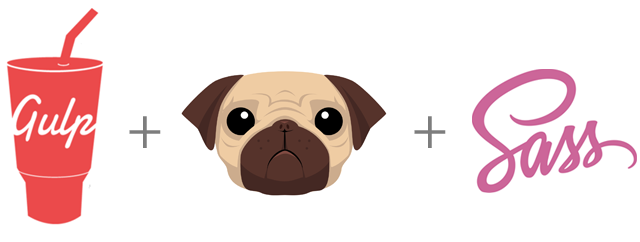

# Spugss

## Requirements

Node.js

## Installation

Clone repository and run `npm install` to install dependencies.

To run the main task : `gulp`

This will compile Sass files, Pug files, minify css & JS and launch in browser.

## Configuration

Just change the `proxy` variable on top of your gulpfile.js to point to the right server URL.

### Pug

Pug sources files are located in `app/views/`

### Sass

Sass files are located in `app/assets/styles` and uses [Bourbon](https://github.com/thoughtbot/bourbon), [Neat](https://github.com/thoughtbot/neat) & [Bitters](https://github.com/thoughtbot/bitters)

You can add stylesheets files directly to the `app/assets/styles/lib/` directory. They will be automatically added to your app's css file, minified.

### Javascript

JS files are located in `app/assets/scripts`.

You can add libraries of your choice directly to the `app/assets/scripts/lib/` directory. They will be automatically added to your app's script file, minified.

### Destination

Destination files are automatically  generated in `build/` 

Enjoy!